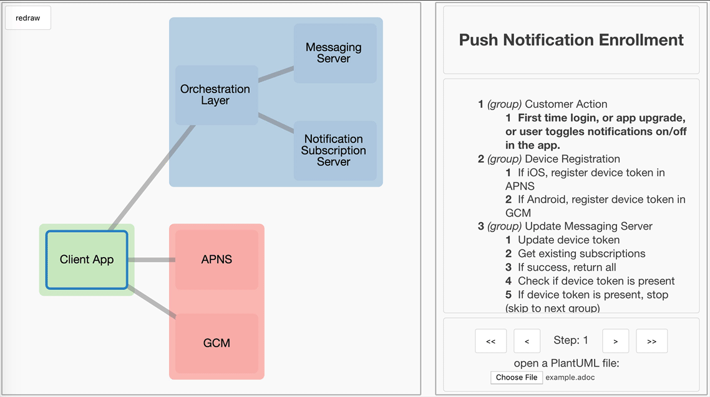

<!-- START doctoc generated TOC please keep comment here to allow auto update -->
<!-- DON'T EDIT THIS SECTION, INSTEAD RE-RUN doctoc TO UPDATE -->
**Table of Contents**  *generated with [DocToc](https://github.com/thlorenz/doctoc)*

- [Architecture Diagram Web App](#architecture-diagram-web-app)
  - [Demo](#demo)
  - [Usage](#usage)
  - [Features](#features)
    - [Supported File Formats](#supported-file-formats)
      - [PlantUML](#plantuml)
      - [JSON](#json)
    - [Embedding in Wikis and Webpages](#embedding-in-wikis-and-webpages)
    - [Deployment (for developers)](#deployment-for-developers)
      - [Build Requirements](#build-requirements)
      - [Build steps](#build-steps)
    - [Contributing](#contributing)

<!-- END doctoc generated TOC please keep comment here to allow auto update -->

# Architecture Diagram Web App 

Start building and analyzing technical flows in seconds!

[PlantUML sequence diagrams](http://plantuml.com/sequence-diagram) are very useful for documenting API flows.  However, they can often overwhelm you with detail, which obscures the high level architecture.

The architecture-viewer converts PlantUML sequence diagrams into interactive HTML architecture diagrams, which make it easier to step through the sequence, without losing the high level context.

## Demo



The PlantUML source for this demo is [here](sample_plantuml_data/example.adoc).

## Usage 

1) Open a JSON or PlantUML file directly [in the webpage](https://capitalone.github.io/architecture-viewer/).

2) Launch [the webpage](https://capitalone.github.io/architecture-viewer/?url=https://raw.githubusercontent.com/capitalone/architecture-viewer/master/sample_json_data/large_web.json) directly with a `?url=` query parameter linking to the JSON or PlantUML file to display, e.g.
```
https://capitalone.github.io/architecture-viewer/?url=https://raw.githubusercontent.com/capitalone/architecture-viewer/master/sample_json_data/large_web.json
```

The same can be done with a plantUML file, as seen [here](https://capitalone.github.io/architecture-viewer/?url=https://raw.githubusercontent.com/capitalone/architecture-viewer/master/sample_plantuml_data/example.adoc)

```
https://capitalone.github.io/architecture-viewer/?url=https://raw.githubusercontent.com/capitalone/architecture-viewer/master/sample_plantuml_data/example.adoc
```

## Features

- Each node is clickable. Once clicked, a popup with details about them will appear.
- Each step from the sequence diagram is listed in the sidebar.
- Step through each part of the flow and see it visualized in an easy to digest graph.
- Notes can be added to steps for clarity.

### Supported File Formats

#### PlantUML

The architecture-viewer supports a subset of the [PlantUML sequence diagrams syntax](http://plantuml.com/sequence-diagram).  This repository also includes [this example](sample_plantuml_data/example.adoc) which was used to generate the demo above.

The following PlantUML sequence diagram features are supported:

- `@startuml` and `@enduml` to indicate diagrams
- `title << title text here >>` to declare a title
- `autonumber` is ignored and starts the indices at 0 (but the table of contents starts at 1)
- participants are able to be created using the `participant` and `actor` keyword, and the following syntax is valid
    - `participant A`
    - `participant "AAA" as A`
    - `participant "A"`
- stereotypes (`<< (X, zone_color) zone_name >>`) can be used with participants to provide colors, and to group participants into zones
    - `participant A << (X, #000000) zoneA >>`
    - `participant "AAA" as A << (X, #000000) zoneA >>`
    - `participant "A" << (X, #000000) zoneA >>`
- steps 
    - the following syntax for steps (and their backwards form) are supported
        - `->`
        - `-\`
        - `-/`
        - `->>`
        - `-\\`
        - `-//`
        - `-->`
        - `--\\`
        - `--//`
        - `-->>`
    - the following syntax for arrows is NOT supported
        - `-[#red]>`
- grouping
    - The following grouping keywords are supported
        - loops
        ```
        loop [x times]
            <<steps here>>
        end
        ```
        - groups
        ```
        group <<text to be displayed>>
            <<steps here>>
        end
        ```
    - Nested loops are supported
- notes
    - The following syntax is supported
            - single line notes: `note [left|right]: <<text to be displayed>>`  
            - multiline notes
            
            note [left|right]
            <<text to be displayed>>
            end note
    - Notes over steps, and notes over participants (notes over participants translate to clickable tooltips on nodes) are supported
- any other line included will be ignored
- WARNING: using any other blocked feature (such as `alt`) may break the renderer. Make sure the .adoc file uploaded does not contain any unsupported features

To change the default diagram, edit `src/assets/data.json` and redeploy. 

#### JSON 

The architecture-viewer uses a custom JSON format as input.  PlantUML files are converted into this format for rendering.  You may also import files directly if they are in this format.

You need to define the following JSON fields:
 - `title` 
 - `graphData` 
  - `nodes`
    - `id` (shorthand id, ex. FBI)
    - `fname` (longhand name, ex. Federal Bureau of Investigation)
    - `zone` (optional)
    - `info` (optional)
  - `edges`
    - `id`
    - `source`
    - `target`
 - `stepData` (optional)

 _note: the graphData in the JSON is compatible with [cytoscape](http://www.cytoscape.org/)_

Example (JSON):
```javascript
{
    "title": "some_title",
    "graphData": {
        "nodes": [
            {
                "data": {
                    "id": "s_id",
                    "fname": "some_id",
                    "zone": "#ffb2b2",
                    "info": "info about some_id"
                }
            },
            {
                "data": {
                    "id": "s_id_2",
                    "fname": "some_id_2",
                    "zone": "#b2b2ff",
                    "info": "info about some_id_2"
                }
            }
        ],
        "edges": [
            {
                "data": {
                    "id": "some_edge_id",
                    "source": "s_id",
                    "target": "s_id_2"
                }
            }
        ]
    },
    "stepData": [
        {
            "id": "0",
            "type": "single",
            "nodes": [
                "some_id",
                "some_id_2"
            ],
            "steps": [],
            "description": "an example step",
            "note": ""
        }
    ]
}
```

### Embedding in Wikis and Webpages

You can embed the interactive architecture-viewer using an `<iframe>` tag, e.g.

```html
<iframe height="600" src="https://capitalone.github.io/architecture-viewer/?url=https://github.com/raw/capitalone/architecture-viewer/master/sample_plantuml_data/example.adoc" width="100%"> </iframe>
```

Some content management/collaboration software (e.g. [Confluence](https://www.atlassian.com/software/confluence)) will block external sites, so you may need to add your architecture-viewer domain to a whitelist before it will display.

### Deployment (for developers)

#### Build Requirements

- node (v12 or later)
- npm (if you meet the node requirements you should meet the npm requirements)

#### Build steps

```
# Install dependencies
npm install

# Start a dev server on http://0.0.0.0:8080/
npm run dev

# Run all the tests located in `tests/`
npm run test

# Build the app and place the built files in `build/`
npm run build

# Deploy the contents of `build/` to the `gh-pages` branch (assumes you have git commit permission)
npm run deploy
```

The `build` directory is a static website so it can be deployed to any static hosting platform. 

If you need to customize the base resource paths used by this web application, you can edit the provided [preact.config.js](preact.config.js).

### Contributing

We welcome Your interest in Capital One’s Open Source Projects (the “Project”). Any Contributor to the Project must accept and sign an Agreement indicating agreement to the license terms below. Except for the license granted in this Agreement to Capital One and to recipients of software distributed by Capital One, You reserve all right, title, and interest in and to Your Contributions; this Agreement does not impact Your rights to use Your own Contributions for any other purpose.

[Sign the Individual Agreement](https://cla-assistant.io/capitalone/architecture-viewer)

[Sign the Corporate Agreement](https://docs.google.com/forms/d/e/1FAIpQLSeAbobIPLCVZD_ccgtMWBDAcN68oqbAJBQyDTSAQ1AkYuCp_g/viewform?usp=send_form)

This project adheres to the [Open Code of Conduct](http://www.capitalone.io/codeofconduct/). By participating, you are expected to honor this code.
